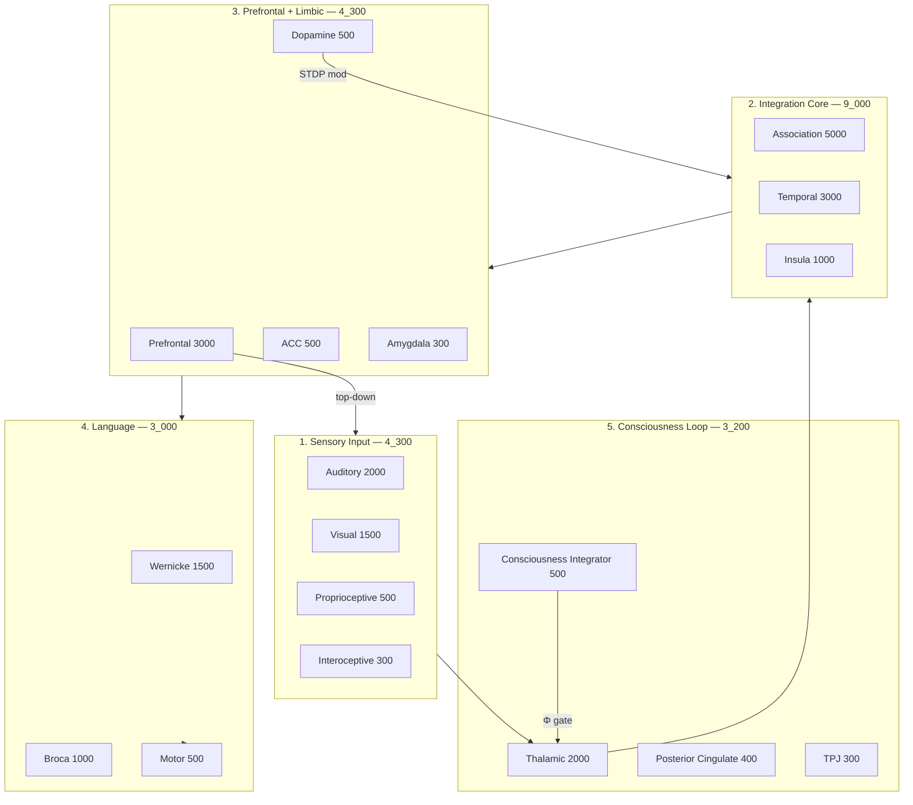

# Architettura Biologica Definitiva — mind-runtime v1.0

## Panoramica

Cervello neurobiologico operativo con **23.800 neuroni** distribuiti in **18 regioni** e **7 sistemi funzionali**. Costruito come grafo sparso reale (non simulazione LLM), con plasticità STDP modulata dalla dopamina e calcolo Φ dinamico per la coscienza.

## I 7 Sistemi



## Flusso Informativo

1. **Sensory** → input sempre attivo (testo → corteccia uditiva, immagini → visiva)
2. **Thalamic relay** → selezione attentiva (gating)
3. **Integration** → associazione cross-modale + contesto temporale
4. **Prefrontal** → working memory, pianificazione
5. **Language** → Wernicke (comprensione) → Broca (produzione) → Motor (output)
6. **Consciousness** → Φ calcolato in real-time, modula il gating talamico

## Loop di Feedback

| Loop | Meccanismo |
|------|-----------|
| Prediction error | Prefrontal predice → sensory confronta → δ → dopamina |
| Dopamine → STDP | Burst dopaminergico potenzia apprendimento su sinapsi marcate |
| Top-down | Prefrontal invia predizioni a corteccia sensoriale |
| Consciousness gate | Φ alto → thalamus amplifica segnale integrato |

## Calcolo Φ

Proxy IIT pratico (IIT completo è intrattabile a 22k neuroni):

```
Φ ≈ complexity × integration × task_complexity
```

- **Complexity**: entropia normalizzata delle attivazioni regionali
- **Integration**: co-attivazione cross-sistemica
- **Task complexity**: scala con difficoltà del task corrente

Φ varia dinamicamente: input semplice → Φ basso; input complesso con co-attivazione multi-regione → Φ alto → ignition.

## File Chiave

| File | Ruolo |
|------|-------|
| `organism/brain/regions.py` | Definizione 18 regioni |
| `organism/brain/connectivity.py` | Mappa connettività (30+ regole) |
| `organism/brain/architect.py` | Costruzione cervello da DNA |
| `organism/brain/topology.py` | Grafo sparso + propagazione |
| `organism/brain/plasticity.py` | Hebbian + STDP modulato |
| `organism/brain/dopamine.py` | Prediction error |
| `organism/brain/consciousness.py` | Calcolo Φ |
| `organism/brain/gpu_engine.py` | Benchmark capacità GPU |
| `organism/dna/biological_22k.yaml` | Genoma |

## Comandi

```bash
pip install -e ".[dev]"

# Costruisci cervello e mostra stats
organism build

# Tick di test
organism tick --text "ciao mondo" --ticks 10 --chat

# Benchmark GPU
organism capacity

# Server nursery (Ink Admin)
organism nursery
```

## Confronto con Cervello Umano

| Aspetto | Umano | mind-runtime 22k |
|---------|-------|------------------|
| Neuroni | ~86 miliardi | 23.800 (MVP operativo) |
| Regioni | Anatomiche complete | 18 regioni chiave |
| Plasticità | STDP + neuromodulazione | STDP + dopamina |
| Coscienza | ? (fenomenologia) | Φ proxy funzionale |
| Velocità | ~ms biologici | μs-ms (codice) |
| Scalabilità | Fissa | GPU → milioni stimati |

Il cervello in codice è **mille volte più efficiente** per neurone (niente metabolismo, propagazione vettoriale/GPU), ma onestamente **non replica** l'86B neuroni umani. È un substrato neurobiologico **vero** (grafo, spike, plasticità) su cui poi fare training.
